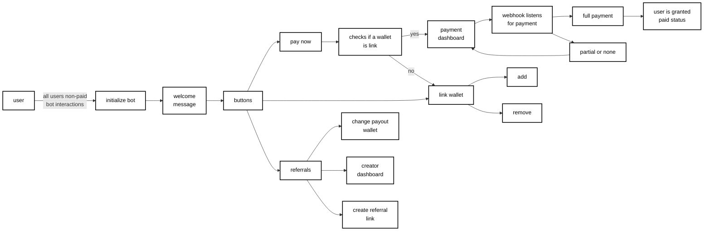
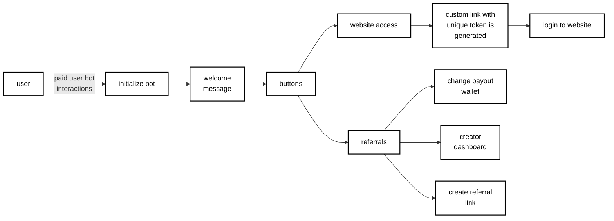

# Telegram Framework

## About

The Framework is still being uploaded. This is Telegram Framework centered around a bot that interacts with users via direct messages. The goal is to provide creators with a framework that handles payments, users, referrals, and private website sessions.

## Branch Info

### Repository Structure

- [📄 README.md](README.md) - Main documentation and framework overview
- [📦 Framework/](Framework/) - Core package for creators to implement the bot framework
- [📝 Installation.md](Installation.md) - Step-by-step installation guide
- [🎬 Sample.md](Sample.md) - Example implementations and demos

## Non-Paid Users Bot Interactions

## Paid Users Bot Interactions

## Documentation

*Documentation coming soon*
